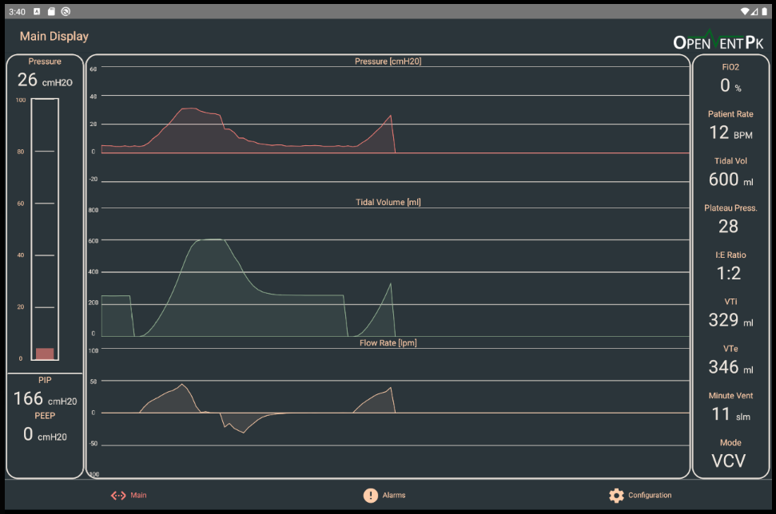

# ventilator-app

Application written in React Native to allow connecting to a ventilator via cable and show information about the ventilation. Our current focus is only on the Android version for now.

## Features

### Monitoring

View the Tidal Volume, Pressure and Flow rate graphs as well as other essential information such as FiO2, Patient Respiratory Rate, Ventilation Mode, Peep etc.

### Alarms

View all the possible alarms that can occur as well as the ones which are active currently.

Regardless of where you are on the screen, if there are any active alarms, they will be shown via a notification banner.

## Contributing

Before submitting a pull request, please take a moment to look over the [contributing guidelines](./CONTRIBUTING.md) first.

## License

The ventilator app is available under the [BSD-3-Clause License](./LICENSE).
